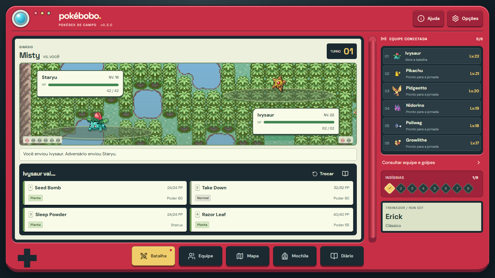

# Pokébobo — 0.4.0 · Semanas Vivas

Um roguelike de carreira Pokémon, feito para jogar no celular na vertical. Monte sua região e tente sobreviver às consequências. Agora as próprias semanas também podem virar histórias.

A 0.4.0 mantém a Pokédex de campo da 0.3.0 e faz a carreira reagir às semanas gastas: são 57 acontecimentos com escolhas, riscos, recompensas e consequências futuras. O C03 continua apresentando cada turno em sequência, com ataque, HP, status, queda, troca e velocidade 1×/2×. Veja o [ROADMAP](docs/ROADMAP.md) e o [guia da interface](docs/INTERFACE.md). São 156 módulos JavaScript/JSX e 30 arquivos CSS ativos.

Para continuar o desenvolvimento: [arquitetura](docs/ARQUITETURA.md), [onde editar](docs/ONDE-EDITAR.md) e [pesquisa de capas de rotas](docs/ARTES-E-ROTAS.md).



[Tela inicial](docs/images/inicio.png) · [Batalha no celular](docs/images/batalha-celular.png)

## Jogar

**Saves atuais continuam funcionando na 0.4.0.** O schema 3 foi preservado; campos de acontecimentos são inicializados quando necessários. **Saves anteriores à 0.2.2 reiniciam: os sets e replays antigos usam outra regra de aprendizado.** Conforme a decisão de testar uma regra por vez, não há motor antigo nem migração paralela. Opções → Zerar progresso de teste permite começar novamente, com confirmação.

Requer Node.js 22.13+ e npm. Para rodar o jogo:

```sh
git clone https://github.com/erereck/pokebobo.git
cd pokebobo
npm ci
npm run dev
```

Abra o endereço exibido pelo Vite (por padrão, http://localhost:4173/). No celular conectado à mesma rede Wi-Fi, use o endereço de rede exibido. O servidor precisa continuar aberto e não reinicia sozinho depois que o computador é desligado.

O save fica no navegador; **Opções → Exportar progresso** guarda uma cópia em JSON. Saves de cada endereço/navegador são separados. O repositório contém o código-fonte, não uma hospedagem do jogo.

**A partir de 15/09/2026, o HTML standalone deixou de ser atualizado ou distribuído, por decisão do usuário.** O fluxo oficial é a aplicação web. O script legado de standalone permanece apenas como referência e não participa da verificação.

## O que funciona

- **Semanas Vivas:** 57 acontecimentos sorteados pela seed, com raridades, anti-repetição, escolhas e consequências. A chance base é 72% por semana (82% na Correria). Eventos podem conceder ou consumir recursos, melhorar treino/captura/busca, abrir encontro extra, devolver ou gastar uma ação, iniciar batalha e destravar follow-ups futuros.

- Nome do treinador, sete conjuntos de iniciais (gerações 1–5, 7 e 8).
- Draft: cidade inicial, passagem e oito ginásios, sem repetir cidades e sem exibir os tipos dos líderes. Cada oferta reúne líderes da mesma posição nos jogos de origem.
- 37 cidades de ginásio, de Kanto, Johto, Hoenn, Sinnoh, Unova e Galar. Kalos não entra.
- Limite de três semanas por cidade. Depois da última ação e da resolução de eventual acontecimento, a viagem ou o ginásio começa automaticamente.
- Treino (+1 a 3 níveis na equipe), exploração, captura, busca de itens e preparação com berries. Viagem e emboscada: zero níveis. Vitória em ginásio ou Liga: +1.
- Níveis originais por Pokémon do líder. Se o maior nível do jogador exceder o ás original em 10 ou mais, o líder recebe +6 em todos, uma vez. Não há limite de nível por etapa.
- Quatro golpes juntos na batalha, trocas em grade e registro completo em uma janela separada. Cada turno é apresentado em sequência (ataque, HP, status, queda e troca), com velocidade 1×/2×.
- Duas espécies de famílias distintas por rota, priorizando famílias ainda não vistas; uma tentativa por espécie, com 86% de chance base (eventos podem elevar até 98%) e custo de uma Poké Bola. Equipe de até seis; ao capturar com time cheio, escolha quem será substituído apenas se a captura der certo.
- Batalhas aleatórias: chance de 10% após uma ação elegível, com intervalo mínimo de três semanas entre emboscadas.
- Batalhas reais do Pokémon Showdown via `@pkmn/sim`, inteiramente no navegador. Golpes, PP, habilidades, tipos, status, prioridade, dano, trocas e itens seguem o motor.
- Saves reproduzíveis de batalha por seed e histórico de decisões. Recarregar não rerrola a luta.
- Derrota definitiva; diário da run, recordes e oito insígnias.
- Liga: quatro membros diferentes sorteados entre onze opções, seguidos por um de três campeões. Os elencos usam as espécies dos jogos indicados; os níveis e golpes foram adaptados à progressão.
- Vitória libera Correria (duas semanas) e Nuzlocke (Pokémon derrotados saem do time).
- Fontes, sprites e seis mapas de Emerald locais, incluídos no build web. Paisagens de referência, com créditos e fallback SVG.
- IA estima dano e utilidade, considera prioridade, PP, cura, status e trocas; não usa movimentos ocultos, itens ocultos ou a escolha do jogador.

## Recorte consciente do protótipo

As batalhas usam regras singles da geração 8. Não há multiplayer, Dynamax, Mega Evolução nem editor de golpes. Os golpes são escolhidos automaticamente a partir dos learnsets por nível do Showdown, buscando STAB e cobertura, e não reproduzem um moveset histórico único. O gerador escolhe uma geração comum à linhagem (8, com fallback para 7), conserva níveis herdados e distingue golpes de evolução dos lembretes. Lembretes exclusivos ficam fora da seleção automática. A origem de cada golpe está no catálogo e na auditoria; veja REGRAS-DE-GOLPES.md. Mossdeep conserva o elenco de Emerald em batalha singles. Ainda não há todas as equipes de todas as gerações.

Evoluções simples por nível estão prontas. Troca, pedra, amizade e condições especiais não evoluem automaticamente. Não existe PC/reserva. Capturas podem substituir um integrante escolhido. Toda vitória recupera a equipe, com exceção dos removidos pelo Nuzlocke. Na rodada 0.2.2 foram simuladas 800 campanhas com batalhas reais no Clássico; a rodada anterior dos três modos fica como referência histórica. Isso testa políticas automáticas e identifica problemas; não determina a taxa de vitória de pessoas. As políticas automáticas ainda precisam ser ajustadas à economia da Correria e à sobrevivência da Nuzlocke.

O save local é para uso individual e pode ser editado pelo dono do aparelho. Não há verificação competitiva contra adulteração.

## Desenvolvimento

Requer Node.js 22.13+ (validado aqui com Node 26).

```sh
npm ci
npm run dev
npm run check
npm test
node scripts/catalog.mjs
node scripts/audit-moves.mjs
npm run balance:audit
npm run balance:monte-carlo -- --runs 100 --seed 20260913
npm run verify
```

No PowerShell com política de scripts restrita, use `npm.cmd`.

`npm run verify` executa verificação de arquitetura, testes e build Vite. `npm run build` gera a aplicação estática em `dist/`, que pode ser servida em qualquer hospedagem estática; `npm run preview` permite conferir esse build localmente. Não há servidor de batalha nem variáveis secretas. `node_modules/`, `dist/`, ZIPs de distribuição e o HTML standalone ficam fora do Git.

### Estrutura

| Pasta / arquivo                                              | Responsabilidade                                                             |
| ------------------------------------------------------------ | ---------------------------------------------------------------------------- |
| `src/main.jsx`                                               | Montagem da aplicação e importação dos estilos                               |
| `src/app/`                                                   | Composição das telas, sessão, autosave e versão                              |
| `src/features/`                                              | Componentes separados por parte do jogo                                      |
| `src/components/`                                            | Componentes compartilhados de estrutura e apresentação                       |
| `src/game/state/` e `actions/`                               | Estado e um handler por ação do jogador                                      |
| `src/game/config/`                                           | Parâmetros de progressão, campanha, encontros e itens                        |
| `src/game/data/`                                             | Conteúdo dividido por região, bioma e categoria                              |
| `src/game/career/` e `world/`                                | Semanas, treino, diário e progressão entre cidades                           |
| `src/game/pokemon/`                                          | Criação, golpes, evolução e sets de batalha                                  |
| `src/game/battle/`                                           | Showdown, IA, replay e tradução de eventos                                   |
| `src/game/persistence/`                                      | Leitura e gravação do progresso                                              |
| `src/game/catalog.json`                                      | Recorte de atributos e learnsets gerado do Showdown                          |
| `src/styles/`                                                | Estilos divididos por fundamento, componente, tela e breakpoint              |
| `scripts/catalog.mjs` e `scripts/catalog/learnsetPolicy.mjs` | Regeneram catálogo, procedência, exclusões e verificam sprites               |
| `scripts/standalone.mjs`                                     | Referência legada; fora do fluxo de manutenção e distribuição                |
| `scripts/check-architecture.mjs`                             | Verifica imports locais, ciclos e dependências entre camadas                 |
| `scripts/audit-progression.mjs`                              | Mede orçamento de níveis de quatro estratégias                               |
| `scripts/monte-carlo.mjs` e `simulation/`                    | Campanhas com combates reais, políticas, seeds e relatório JSON              |
| `tests/`                                                     | 43 testes por domínio; fixtures históricas da 0.1 arquivadas em docs/archive |
| `docs/`                                                      | Guia de edição, arquitetura, backlog e pesquisa de assets                    |

As APIs antigas em `game/engine.js`, `data.js`, `pokemon.js` e `battle.js` continuam como reexports pequenos. Consulte [ONDE-EDITAR.md](docs/ONDE-EDITAR.md) para encontrar o arquivo de cada alteração.

## Referências e créditos

Capas e fontes de elencos: [ARTES-E-ROTAS.md](docs/ARTES-E-ROTAS.md) e [dados dos ginásios](src/game/data/gyms/). As tabelas de encontros são uma curadoria do Pokébobo, não a reprodução exata de encontros de cartucho.

O conceito e o recorte vieram da conversa **Ideia do Pokébobo**. A filosofia de carreiras rápidas e escolhas com consequência segue [Futbobo](https://github.com/erereck/futbobo) e [Gamebobo](https://github.com/erereck/gamebobo). A separação de regras e telas preserva essa referência; o visual atual segue a Pokédex pedida pelo usuário e a disciplina da skill [interface-design](https://github.com/Dammyjay93/interface-design). O código do Pokébobo foi escrito neste projeto.

- [Pokémon Showdown](https://github.com/smogon/pokemon-showdown) / [@pkmn/sim](https://github.com/pkmn/ps/tree/main/sim): motor e dados, MIT.
- [PokéAPI sprites](https://github.com/PokeAPI/sprites): sprites de Pokémon; os personagens e sua arte pertencem aos respectivos titulares. Formas alternativas podem usar o sprite da espécie base neste protótipo.
- [React](https://github.com/facebook/react): MIT.
- [Lucide](https://github.com/lucide-icons/lucide): ISC.
- Silkscreen, DM Sans e Space Grotesk: SIL Open Font License, cópias em `licenses/`.
- Paisagens e elementos de interface: SVG criado para o protótipo.

Pokébobo é um projeto de fã e não é afiliado à Nintendo, Game Freak ou The Pokémon Company. Licenças dos componentes estão em `licenses/`; a licença dos motores não transfere direitos sobre personagens e sprites.

## Verificação realizada

Testes automatizados para draft sem repetições, limite semanal, captura e última semana, evolução, replay determinístico do Showdown, derrota definitiva, troca forçada, campanha com oito ginásios e Liga, desbloqueios e persistência. A campanha completa automatizada usa uma equipe forte de teste para conferir as transições; ela não mede a dificuldade de uma run normal.

Inspeção no navegador em 390 px e desktop, incluindo seleção de inicial, draft, exploração, captura, batalha com múltiplos Pokémon, troca, vitória e recarregamento durante o combate. Consulte `VALIDACAO.md` para o resultado final.
