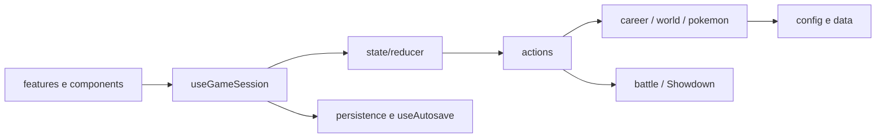

# Arquitetura do Pokébobo 0.3.0

O código foi dividido por responsabilidade, com 148 módulos JavaScript/JSX e 29 arquivos CSS (incluindo o índice de estilos). Telas, ações, regras, dados e persistência têm pastas próprias. O objetivo é localizar uma mudança sem reler o jogo inteiro.

## Fluxo principal



`main.jsx` apenas monta o React e importa estilos. `app/App.jsx` compõe a aplicação. `RunContent.jsx` decide qual tela da run aparece. `useGameSession` concentra estado, navegação e dispatch; `useAutosave` grava o progresso e informa falhas.

## Pastas

| Caminho                 | Conteúdo e regra de organização                                                                                                  |
| ----------------------- | -------------------------------------------------------------------------------------------------------------------------------- |
| `src/app/`              | Composição, sessão, limite de erro e versão visível                                                                              |
| `src/components/`       | Elementos compartilhados: marca, ícones, estrutura, sprites, paisagens, modal e etiquetas                                        |
| `src/features/`         | Uma pasta por parte do jogo: onboarding, draft, carreira, equipe, região, diário, inventário, encontro, batalha, Liga, encerramento e opções |
| `src/game/state/`       | Estado inicial e tabela que encaminha cada ação ao seu handler                                                                   |
| `src/game/actions/`     | Um arquivo por comando do jogador, como TRAIN, CAPTURE e BATTLE_CHOICE                                                           |
| `src/game/career/`      | Semanas, treino, diário e fim de carreira                                                                                        |
| `src/game/world/`       | Construção do caminho, chegada e avanço entre cidades                                                                            |
| `src/game/pokemon/`     | Criação, evolução, golpes e conversão para sets do Showdown                                                                      |
| `src/game/battle/`      | Criação, reconstrução, IA, snapshot, resultado e tradução de eventos                                                             |
| `src/game/config/`      | Números de progressão, duração de campanha, encontros e itens                                                                    |
| `src/game/data/`        | Origens, vilas, biomas, tipos; ginásios por região; encontros por bioma; elencos da Liga                                         |
| `src/game/random/`      | Sorteios reproduzíveis; toda aleatoriedade de gameplay deve passar aqui                                                          |
| `src/game/selectors/`   | Consultas derivadas: cidade, limite semanal e nível do desafio                                                                   |
| `src/game/persistence/` | Chave de save, leitura e gravação                                                                                                |
| `src/shared/`           | Utilitários pequenos de interface e download                                                                                     |
| `src/styles/`           | Estilos fundamentais, compartilhados, por feature e por breakpoint                                                               |
| `public/`               | Sprites, fontes e mapas de referência locais                                                                                     |
| `scripts/`              | Catálogo, HTML portátil, auditoria de níveis, Monte Carlo e verificação de dependências                                          |
| `tests/`                | Testes por domínio, helpers de campanha e fixtures de regressão                                                                  |
| `docs/`                 | Arquitetura, roteiro de edição, backlog, pesquisa visual e diagnóstico                                                           |

Os arquivos `game/engine.js`, `data.js`, `pokemon.js` e `battle.js` são fachadas pequenas: reexportam as APIs anteriores para manter imports externos e scripts compatíveis. A implementação existe nas subpastas, sem cópias paralelas.

## Como manter a separação

- A UI lê o estado e envia ações; a regra não depende de React, DOM ou telas.
- Cada handler recebe uma cópia do estado produzida pelo reducer. Não adicionar outra cópia dentro de cada helper sem necessidade.
- `data/` descreve conteúdo e `config/` descreve parâmetros. Essas pastas não importam comportamento.
- Os seletores calculam valores sem gravar mudanças. Os helpers de carreira/mundo podem modificar a cópia da run recebida pelo handler.
- A ordem dos sorteios faz parte da compatibilidade do replay. Mudar quantidade ou ordem de chamadas altera o futuro das seeds.
- O save guarda a seed e as decisões de combate. `restoreBattle` reconstrói a instância do Showdown; ela não é serializada diretamente.
- `src/styles/index.css` define a ordem da cascata. Um breakpoint fica em arquivo próprio; não reorganizar os imports alfabeticamente.
- A distribuição vem de `package.json`. SAVE_VERSION=3 rejeita schemas anteriores; saves da 0.2.2 permanecem compatíveis na 0.3.0. Há somente um conjunto de regras ativo; a chave local é mantida para detectar e reiniciar saves antigos, como autorizado pelo usuário.

## O que continua unido de propósito

`catalog.json` é um dado gerado, consultado como catálogo pelo jogo. Dividi-lo manualmente por espécie multiplicaria arquivos sem facilitar manutenção. Altere seu gerador e regenere o catálogo quando necessário. O mesmo vale para fixtures congeladas de regressão: são evidência histórica, não código para editar junto da implementação.

Desde 15/09/2026, por decisão do usuário, o código-fonte em https://github.com/erereck/pokebobo e o build web são o fluxo oficial. `npm run build` gera `dist/`; `npm run preview` serve esse build para conferência. O `Pokebobo.html` standalone não deve ser regenerado nem enviado. Seu gerador permanece apenas como referência legada.

## Verificações

Execute os comandos dentro da pasta do projeto:

```sh
npm run check
npm test
npm run balance:audit
npm run build
```

`check` inspeciona imports estáticos, caminhos locais, ciclos e as fronteiras entre dados, regras e telas. Não substitui teste no navegador. `verify` reúne check, testes e build web, sem standalone. O diagnóstico de níveis é separado porque mede orçamento de crescimento, não dificuldade de combate.

As 926 transições da 0.1 foram preservadas em docs/archive, sem regenerar seus resultados. A 0.2 muda regras intencionalmente e testa draft, progressão, diversidade, substituição, justiça da IA, aprisionamento, saves e equivalência entre simulação incremental e replay.

## Fronteiras adicionadas na 0.2

- `aiObservation.js` filtra informação observável; `aiScoring.js` calcula utilidade sem acesso ao motor; `ai.js` escolhe; `submitAiChoice.js` trata a recusa de troca por aprisionamento revelado.
- `startBattle.js` inicializa o mesmo motor usado por replay e Monte Carlo. A UI ainda reconstrói a luta; o simulador mantém uma instância por combate.
- `gymChallenge.js` calcula níveis individuais e o bônus único de +6 sem alterar os dados originais.
- `signatures.js`, `encounterPool.js` e `createRoute.js` definem encontros ligados às duas cidades e guardam a rota no save.
- `RouteCover.jsx` aplica o recorte definido em `routeCovers.js` à folha original. O HTML incorpora as seis folhas.
- O layout compacto da 0.2 foi substituído na 0.3 por `styles/features/battle.css` e `styles/responsive/pokedex/`; a arena ocupa a altura restante depois dos comandos.

## Ajustes da 0.2.1

- `selectors/levelGain.js`: elegibilidade de treino, cálculo puro de ganhos e textos de teto.
- `selectors/battleVictory.js`: regra de sobrevivência Nuzlocke compartilhada por UI, reducer e simulação.
- `scripts/simulation/summarize.mjs`: estatística isolada, com grupos por inicial/adversário e censurados separados.
- `scripts/audit-moves.mjs`: gera o relatório dos sets e origens de aprendizado; não modifica o catálogo.

## Ajustes da 0.2.2 — D02

- `scripts/catalog/learnsetPolicy.mjs`: linhagem, geração comum, limites de estágio, L0, L1 e procedência.
- `game/config/moves.js`: política atual, gerações aceitas e preferências de status.
- `game/pokemon/moves.js`: seleção apenas entre golpes disponíveis; sem fallback fabricado.
- `scripts/catalog.mjs`: valida conteúdo usado, registra exclusões e hashes. `audit-moves.mjs` cobre ginásios originais/+6, iniciais e todas as posições da Liga.
- Catálogo e relatórios são dados gerados. Saves antigos reiniciam; nenhuma migração ou versão paralela de regra.

## Interface da 0.3.0

- `AppHeader`, `MissionHUD`, `GameNavigation` e `TeamSidebar` compõem a carcaça e os visores. Uma navegação atende PC e celular.
- `TeamScreen` seleciona um integrante; `PokemonDetails` apresenta seus dados e a ação existente de líder. A seleção é estado de UI, não altera o save.
- `BagScreen` consulta estoque e envia EXPLORE/PREPARE/FORAGE já existentes; não duplica regras nem cria itens.
- `RegionMap` desenha os dez nós da rota e a Liga, com posição e conclusão derivadas da run.
- `useBattleKeys` aciona botões habilitados, bloqueia campos/janelas e remove seu listener ao sair. `Modal` devolve foco ao disparador.
- `src/styles/index.css` importa fundamentos, estrutura, telas e depois respostas de altura/largura. O arquivo `landscape.css` é específico para combate horizontal. Manter a ordem explícita.
- Componentes antigos de rodapé, sidebar editorial, preview redundante de equipe e navegação mobile separada foram removidos. O motor não foi modificado.
- [INTERFACE.md](INTERFACE.md) e [.interface-design/system.md](../.interface-design/system.md) guardam decisões para os próximos updates.
