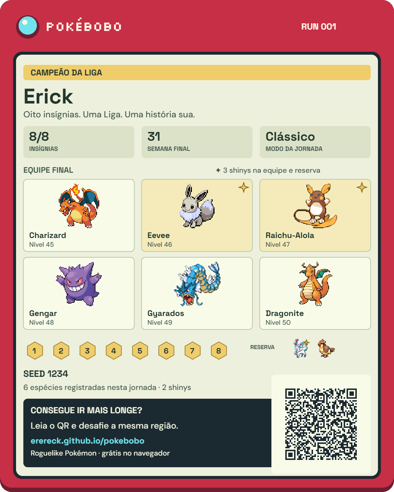

# Sua coleção e suas jornadas — 0.17.0

## Completar a Pokédex

Abra Pokédex no cabeçalho. As capturas e evoluções dos três slots permanecem neste navegador, inclusive quando um Pokémon sai da equipe.

- **Registrados / Catálogo / Faltam:** consultar sua coleção, todas as entradas ou o que ainda falta.
- **Região e tipo:** combinam com nome/número e variantes. O progresso considera as 485 espécies e formas únicas do catálogo do Pokébobo, não todas as espécies dos jogos oficiais. Formas de Alola/Galar contam na região da forma.
- **Normal / Shinies / Normal + shiny:** consulte os registros reais de cada variante. Só um shiny não preenche a variante normal. Comparar aparece na ficha quando ambas foram registradas.
- **Jornadas:** veja em qual slot/run a variante foi registrada. Selecionar Normal ou Shiny filtra essas jornadas; Comparar mostra ambas. Famílias ramificadas são navegáveis, incluindo todos os oito caminhos de Eevee.
- **Últimas descobertas:** ordem em que novas espécies entraram na coleção. Não é uma ordenação global por data de todas as recapturas.

Limpar filtros volta à sua coleção. Consultar um membro da família abre o catálogo e limpa filtros incompatíveis para que a ficha escolhida apareça. Saves antigos recuperam as equipes conhecidas; não inventam capturas antigas que já tinham saído delas.

## Compartilhar uma jornada

Na tela final ou em cada entrada do Hall, toque em **Compartilhar jornada**.

1. Confira o cartão com equipe/reserva, shinies, níveis, insígnias, resultado, semana, modo e seed.
2. **Baixar cartão PNG** exporta a imagem em 1080×1350. Envie ou publique pelo aplicativo de sua escolha.
3. **Copiar convite da região** copia um link para jogar o mesmo percurso. O QR do cartão contém esse mesmo link. Se o navegador negar a cópia, o campo fica selecionado para copiar manualmente.
4. **Compartilhar imagem** aparece quando o navegador aceita compartilhar arquivos PNG. Cancelar fecha a folha nativa sem reportar sucesso. Se falhar, PNG e link continuam disponíveis.

O cartão é composto neste aparelho com sprites/fontes locais. Não é uma screenshot do navegador e não depende de um serviço externo de geração ou encurtamento de URLs. Abrir, baixar ou copiar não muda o resultado da run, seu estoque ou RNG.

## Jogar a região do amigo

Abra o link/QR ou cole o convite em **Nova aventura → Jogar um desafio ou usar uma seed**, ou **Opções → Jogar desafio de um amigo**.

O convite traz cidade inicial, passagem, oito ginásios, modo, seed e sorteio inicial da rota. Você escolhe um dos três iniciais da origem compartilhada e parte com uma equipe nova. As cidades são iguais; suas decisões podem mudar encontros posteriores, equipe e resultado. Não é multiplayer nem um replay da campanha do outro jogador.

Uma jornada em andamento não pode ser substituída pelo convite: selecione um slot vazio ou termine/encerre a atual. Quando um convite trouxer Correria ou Nuzlocke, esse modo vale para aquela jornada mesmo sem um título local; as aventuras comuns continuam exigindo o desbloqueio normal.

Também é possível digitar uma **seed de 1 a 4294967295**. Nesse caso, você ainda escolhe inicial/cidades no draft. As ofertas são reproduzíveis entre slots com históricos diferentes, sob as mesmas regras e escolhas.

## Registros antigos e limites

Uma região antiga completa permite compartilhar cidades e seed. Como não havia registro do RNG anterior à primeira rota, o cartão avisa que esse sorteio original não foi recuperado. Convites dessa região usam a seed como começo comum; não prometem os encontros originais da run antiga.

Histórico incompleto, sem dez cidades válidas/seed/modo, continua exportando o cartão com o QR da página inicial. Equipe, nível ou quantidade de capturas ausentes não são inventados. Todos os saves e a coleção seguem locais; não há conta, ranking online ou validação contra save editado.

Os testes de navegador foram feitos em Edge com PC e celulares emulados. Download/PNG e decodificação do QR são reais; os testes de Web Share simulam sucesso, cancelamento e falha. Não houve envio real para redes sociais nem teste em telefone físico/iOS. Recompressão de imagem por cada aplicativo ainda precisa ser conferida.

## Continuidade técnica

- Convite `PB1.seedBase36.modo.rngBase36.cidades`: somente parâmetros iniciais canônicos, sem equipe, níveis, recursos ou decisões. Valida posição/ordem dos ginásios, cidade de passagem, unicidade e inteiros uint32. Rejeita formato desconhecido, dados incompletos e valores fora do intervalo.
- `BEGIN` guarda `challengeStartRng` antes de `arrival`. `finishRun` conserva o campo. Schema 4 continua compatível; nenhum reset/migração destrutiva.
- Fluxo de shinies permanece independente; escolher o inicial não consome sorteios da campanha. A escolha da variante não altera regras.
- Seeds manuais passam `fixedSeedDraft` somente para iniciar o draft com a mesma oferta de origens em qualquer slot. Aventuras comuns conservam o primeiro trio inicial existente.
- Mudanças futuras incompatíveis nas regras/dados precisam incrementar o formato do convite e mostrar um aviso, sem perfis paralelos de gameplay.
- QR: [node-qrcode 1.5.4](https://github.com/soldair/node-qrcode), MIT; algoritmo de segmentos usa dijkstrajs, MIT. Licenças em [qrcode-MIT.txt](../public/licenses/qrcode-MIT.txt) e [dijkstrajs-MIT.txt](../public/licenses/dijkstrajs-MIT.txt). Gerador e biblioteca são importados quando se abre um cartão.
- Fontes/sprites reutilizados: [assets de batalha](../public/battle-sprites/README.md), [shinies](../public/sprites/SHINY-ASSETS.md) e `public/fonts/` com licenças existentes.

Verificação e medições em [VALIDACAO](../VALIDACAO.md), [ROADMAP](ROADMAP.md) e `docs/balance/*sharing*0.17.0.json`.
